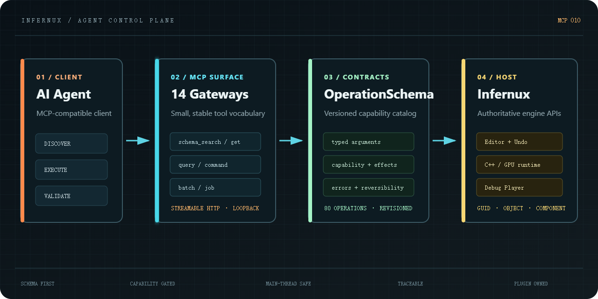

# Infernux MCP

The official Model Context Protocol plugin for [Infernux](https://github.com/ChenlizheMe/Infernux). It gives AI coding agents a structured way to inspect an Infernux project, edit scenes and components, run the game, send input, and validate rendered results inside the Editor.

[简体中文](README.zh-CN.md) · [Infernux Engine](https://github.com/ChenlizheMe/Infernux) · [Plugin Template](https://github.com/InfernuxEngine/infernux_plugin_template) · [Releases](https://github.com/InfernuxEngine/infernux_mcp/releases)



## What an agent can do

- Inspect and edit scene objects, components, DataAssets, materials, particles, and cameras
- Enter Play Mode, pause, step, and stop
- Send keyboard and pointer input through the engine event queue
- Capture the actual Scene, Game, and Player render targets
- Build and control a standalone Debug Player
- Discover operation schemas instead of guessing editor APIs

| Package | Version | Compatible engine | Endpoint |
| --- | --- | --- | --- |
| `infernux/mcp` | 0.1.2 | Infernux 0.4.x | `http://127.0.0.1:9713/mcp` |

## Install and connect

New Infernux projects include this official plugin by default. Existing projects can install or update it from the Editor's **Plugins** window. You can disable or uninstall it there when agent access is not needed.

Point an MCP-compatible client to `http://127.0.0.1:9713/mcp`. The server accepts localhost connections only. Set `INFERNUX_MCP_PORT` before starting the Editor to choose another port.

Start a session with `host_session_status`, then read `operation_schema_list`. Search the catalog with `operation_schema_search`, inspect the exact schema you need, and call it through `operation_command_execute`. Long-running builds belong in `operation_job_submit`; known ordered calls can be grouped with `operation_batch_execute`.

```json
{
  "tool": "operation_schema_search",
  "arguments": {"query": "scene object create", "limit": 10}
}
```

## Repeatable client workflows

The Python client now supports `session`: send one JSON object per input line and
reuse one initialized MCP connection for discovery, dependent edits and status
checks. `call` also accepts `--args-file path.json` (or `-` for stdin), avoiding
nested shell quoting. `--timings` writes client phase measurements to stderr;
stdout remains machine-readable JSON. Operation errors, partial batch failures,
and failed/cancelled jobs return a nonzero exit status.

See [client workflows and latency diagnostics](package/plugin_pages/operations.md#python-client)
for the exact protocol, timeout behavior and a read-only benchmark. These source
changes retain the existing gateway APIs and capability gates; no extra grants
or automatic retries are introduced. The published package version is unchanged
until a release is tagged.

## Compute diagnostics (041)

Search the operation catalog for `runtime.compute`. Read `statistics` for the
engine's cumulative upload/readback bytes, dispatches, submissions and CPU waits;
`reset_statistics` starts a new measurement interval. Enable `profiling` explicitly
to collect native GPU timestamps, and disable it after measuring. Toggling it may
wait for in-flight compute. GPU time describes the latest completed submission,
not an entire frame; use the separate `runtime.performance` window for frame
percentiles. These operations require the matching 041 engine host.

## Repository guide

The installable plugin lives in `package/`. The root README, standalone packer, and GitHub Actions workflow describe and release the repository but do not enter the package. Push a `v<version>` tag to build, verify, and publish the `.inxpkg` plus its release manifest.

## License

[MIT](LICENSE).
