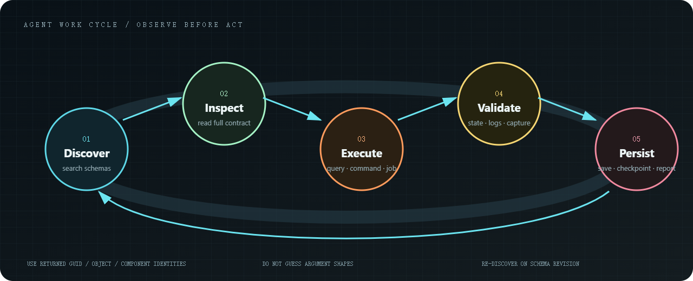

# Usage

This package only exposes a handful of MCP tools. The actual work lives in operations.



1. Search for the operation you need.
2. Read its schema. Do not guess argument names.
3. Call it as a query, a command, or a background job.
4. Keep using the IDs it returned. Assets are GUIDs. Scene objects come from queries.

Before writing an unfamiliar component field, call `infernux.scene.component.schema`.

`infernux.scene.open` and `infernux.scene.reload` return `scheduled: true` when a load is queued. Read `infernux.project.info` afterwards: `active_scene.last_load` contains the requested `path`, `status` (`pending`, `loading`, `loaded`, or `failed`), and the specific `error`. Wait for `loaded` for that path before editing the replacement scene. Also check `active_scene.document_state`: `conflict` means the disk changed again while loading, so the loaded scene is not the latest disk version and the external conflict must be reviewed. A completed MCP job for these operations only confirms that scheduling finished. The previous scene remains active if validation fails.

`active_scene.document_state` identifies an external-file conflict. Resolve it with the editor's reload, keep-local, or save-copy choice before saving. Reload uses the same strict scene format checks as startup, and its dialog displays the parsing error. Correct the reported field in the file before loading it again; component `data` must not contain runtime metadata such as `__type_name__` or `__component_id__`. External editors may use atomic file replacement to save scripts and assets.

Player builds and other slow work should go through `operation_job_submit`. Poll `operation_job_status` instead of waiting on the first call.

## Python client

Use the same Python environment as the Editor. From this plugin checkout, add
`package/editor` to `PYTHONPATH` (preserving existing entries). For example in
Bash: `export PYTHONPATH="$PWD/package/editor${PYTHONPATH:+:$PYTHONPATH}"`.
An installed project uses `Packages/infernux/mcp/editor` instead.

```bash
python -m infernux_mcp.client --timings call host_session_status
python -m infernux_mcp.client call operation_schema_search --args-file search.json
python -m infernux_mcp.client --timeout 30 --timings session
```

Global options precede `call`, `session`, `list-tools` or `describe`. Use
`--endpoint http://127.0.0.1:PORT/mcp` when running multiple Editors.
`search.json` is a UTF-8 object such as `{"query":"scene object create","limit":10}`.
`--args-file -` reads that object from stdin. It is mutually exclusive with
`--args`; malformed input is rejected before connecting.

In `session` mode, write one request per line:

```json
{"id":"status","tool":"host_session_status","arguments":{}}
{"id":"schema","tool":"operation_schema_get","arguments":{"operation":"infernux.scene.object.create"}}
```

Each completed request immediately produces one line:
`{"id":"status","result":{"ok":true,"data":{...}}}`.
`id` is optional and may be a string, integer or null. Only `id`, `tool` and
`arguments` are accepted. Read each result before sending a dependent command;
keep returned object IDs and GUIDs rather than rediscovering them. EOF closes the
connection. Blank lines are ignored. Invalid records and failed calls produce
error results, and later supplied records are still processed. Exit status is
1 if any record failed, otherwise 0 (130 after Ctrl+C). A one-shot `call` also
returns 1 for an operation error, failed batch step, or failed/cancelled job,
while preserving the server envelope on stdout. Arbitrary fields inside an
operation's result are not treated as gateway errors.

The connection is local and uses the existing schemas, capability grants, undo
paths and session identity. Reusing a connection does not authorize additional
actions or suppress client/host confirmation requirements. The CLI never replays a failed call or opens a replacement client to retry it. A timeout or disconnect does not prove a command was
cancelled or rolled back; inspect the scene/job before deciding whether to retry.
Long work still belongs in `operation_job_submit` followed by status queries.
`--timeout` bounds MCP initialization and each request, not the entire session
or idle time waiting for your next input. Network transport cleanup may add time.

## Latency diagnostics

`--timings` prints JSON timing records to stderr without argument or result
payloads. `client_create` includes lazy transport imports; `connect_initialize`
combines connection and MCP initialization; `request` includes transport,
Editor main-thread queueing and operation execution; `serialize` measures local
JSON encoding; `disconnect` and `total` describe cleanup and the CLI lifetime.
`total` excludes Python interpreter/module startup, so measure process wall time
when comparing fresh CLI processes. Client timings cannot isolate Editor queue
wait from execution. Inspect the returned error code, console and engine logs
before attributing a slow request to the network. The CLI labels input,
connection/initialization and request failures separately.

From the plugin checkout, with an Editor already ticking:

```bash
python scripts/benchmark_client.py --endpoint http://127.0.0.1:9713/mcp --samples 3
python -m unittest discover -s test -p 'test_client*.py' -v
```

The benchmark only reads session status, the compact schema catalog, runtime
status, and a 20-query batch. It compares fresh-process wall time against the
same calls on one persistent connection and prints raw phases plus medians.
It changes no project capability settings and never retries failed calls.
Transport tests require `package/requirements.txt`; client-only unit tests can
run without the engine or dependencies (`-p test_client.py`). These measurements
are not render performance or proof of a successful scene load/capture. A
headless host can author and inspect scenes but cannot produce render-target
screenshots; use a graphical Editor for capture verification.
